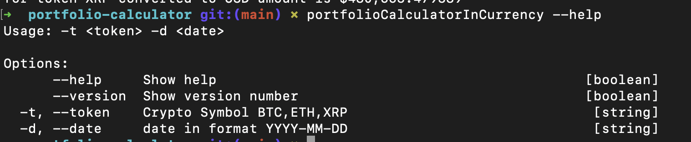
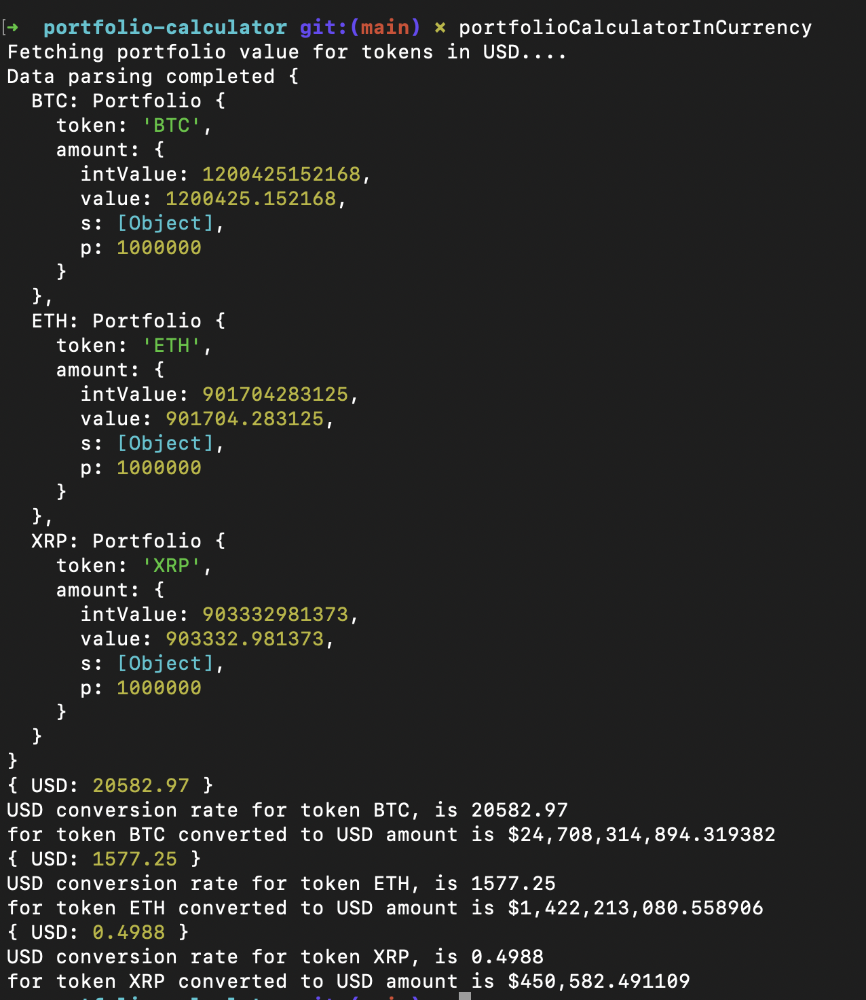
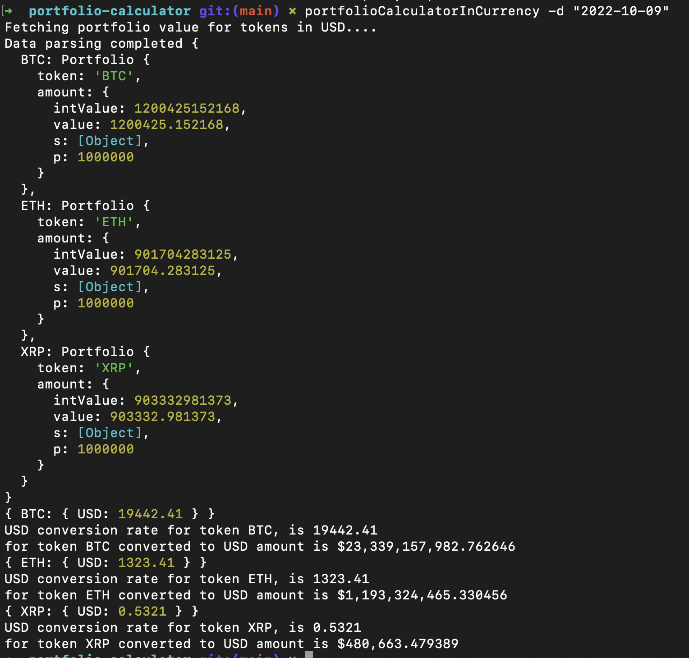
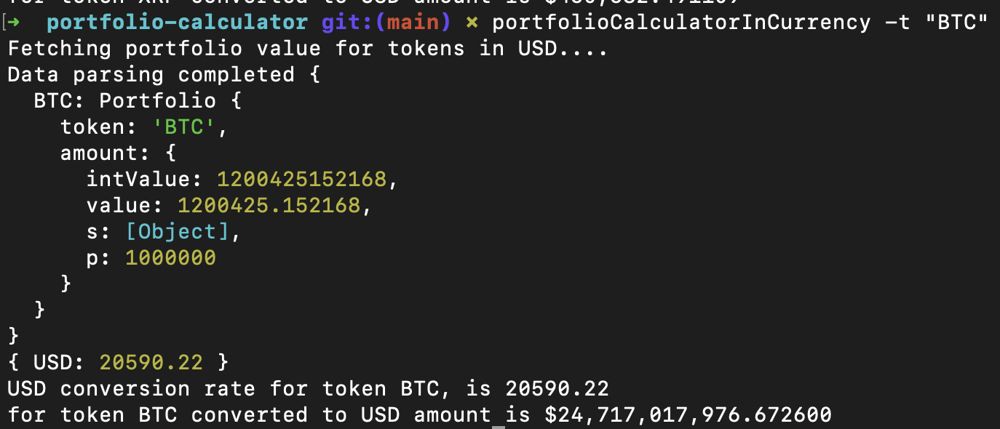
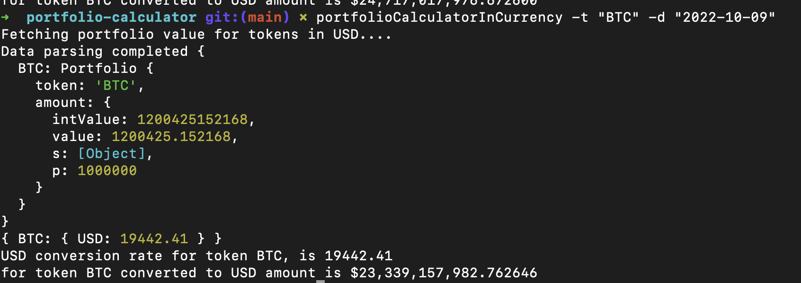

# portfolio-calculator 

NodeJS command line app to find portfolio details based on the given parameters. The parameters include token and date.

## Prerequisites

This app uses :- 

- NodeJS 14.17.0.
- Free Crypto API from [CryptoCompareAPI](https://min-api.cryptocompare.com/documentation) to fetch the latest currency value.
- Mocha/Chai/Sinon for unit tests.

## Installation

- git clone `git@github.com:murtaza-bagwala/portfolio-calculator.git`

- Download [transactions.csv](https://s3-ap-southeast-1.amazonaws.com/static.propine.com/transactions.csv.zip) file and put it in root folder.

- Rename `.env.example` to `.env` and replace `CRYPTO_COMPARE_API_KEY` with the generated key.

- `npm install`.

- `npm install -g .` to install the script globally.

- `portfolioCalculatorInCurrency -t "BTC" -d "2022-11-02"` to run the command line script to fetch the portfolios converted in USD.

- `npm run test` to run the tests.

## Application Design

I am using `yargs` to fetch the command line arguments and then validating the received arguments in `.bin/start.js`. for example if `date` is not valid then it throws an error and shows you the exact format which is `YYYY-MM-DD`. Also, currently as our [transactions.csv](https://s3-ap-southeast-1.amazonaws.com/static.propine.com/transactions.csv.zip) only contains 3 types of cryptocurrencies `BTC`, `ETH` and `XRP`, thats why I am validating that too but we can remove that validation if we need to support any other cryptocurrencies in future. For now currency is set as `USD` by default but in future we can take it as an argument too, rest of the code is generalized with default set as `USD`.

### Model

I have created plain javascript class `Portfolio` to store portfolio details like `token` and `amount` and some of the methods which operates on the `amount` attribute.

### Currency

I am using `currency.js` for the monetary operations as there are floating point issues with the representation of the decimals in binary. Added the precision upto 6 digits after decimal. Having `currency.js` making application little bit slower as each time we add or subtract, it creates new currency object in memory but I think for application like this which deals with monetary assets correctness is more important than performance.

### Strategies

Now once the arguments are validated I use them to create strategy as I am using strategy pattern to invoke strategies/algorithm based on the received parameters, for that I have created various strategies in `./strategies` folder. These strategies parses received record from `CSV` and performs the buisness logic accordingly.

So we have 4 types of strategies :- 

#### allPortfolios

If no option is passed then this strategy will be called to calculate the portfolio values converted to the `USD` for all the tokens. 

#### allPortfoliosByDate

If date option is passed then this strategy will be called to calculate the portfolio values converted to the `USD` for the given date.

#### portfolioByToken

If token option is passed then this strategy will be called to calculate the portfolio value converted to the latest `USD` for the given token.

#### portfolioByDateAndToken

If token and date both options are passed then this strategy will be called to calculate the portfolio value converted to the `USD` for the given date and token.

### CSV Parser

To parse this kind of big CSV file I am using Reactive approach using `NodeJS streams` API. Generally [reactive/event-driven](linkedin.com/pulse/reactive-programming-step-ahead-functional-murtaza-bagwala/) approaches work on 3 events `data`, `error` and `close` and I am passing `strategy` as a callback function to `CSVParser` for `data` event. Code can be found in `./parsers/CSVParser.js`.

### External Services

Once we compute the portfolio values for tokens then we call the external service to fetch the latest conversion rate.

I am using NodeJS `https` module to call an external API because, I prefer to use built-in libraries instead of adding external dependencies to keep application light and avoid dependencies hell.

I am using [CryptoCompareAPI](https://min-api.cryptocompare.com/documentation) APIs to fetch the [latest currency rate](https://min-api.cryptocompare.com/documentation?key=Price&cat=SingleSymbolPriceEndpoint) and [currency rate based on the timestamp](https://min-api.cryptocompare.com/documentation?key=Historical&cat=dataPriceHistorical).

Code for this can be found in `services/CryptoAPI.js`, I have created a generalized function called as `getCryptoToCurrencyConversionRate` which takes `options={token: "BTC", timestamp: 153649404}}` and `currency=USD` type as arguments and returns currency value. we can pass any currency symbol but currently it defaults to `USD`.

### Utils

There are various pure utility functions I have created like :- 
- `DateValidator` to validate the date and its format.
- `DateToTimestampConvertor` converts date to timestamp in epoch, So basically from commandline we get dateString and then we convert it to timestamp and add `86399` seconds to it to get a last timestamp of particluar day for example if dateString is `2022-11-03` then in timestamp it will be `1667556454` equals to `2022-11-03:T23:59:59`. This is done to ensure we get correct conversion rate from external service for that day.
- `PortfolioCalculator` adds or subtracts the amount based on the transaction type.
- `PortfolioCreator` it creates or updates a `portfoliosByToken` map based on the received token, so if token is present it updates the value otherwise it creates new token as a key and adds portfolio details as a value.

### Testcases

I have written testcases for all the modules, used `expect` for assertions and `sinon stub` to stub external API calls.

Tests can be found in `./test`.

### Formatting

Added `eslint` and `prettier` for formattng and conventions.

